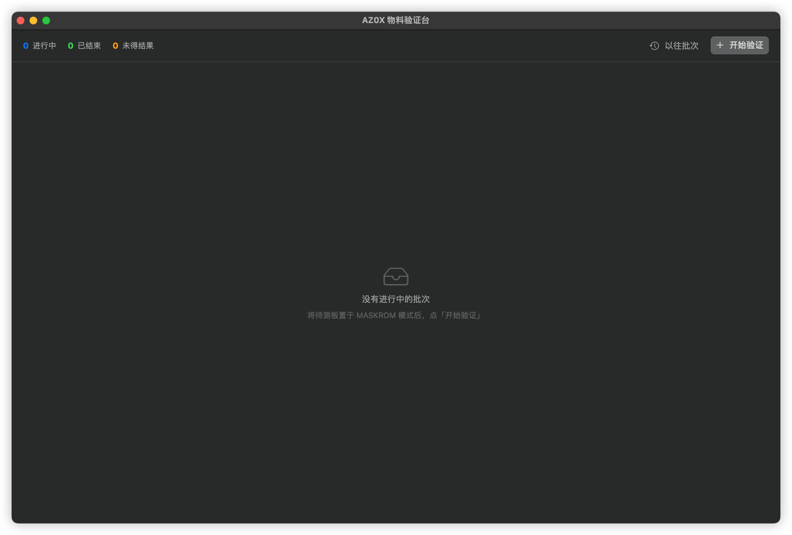
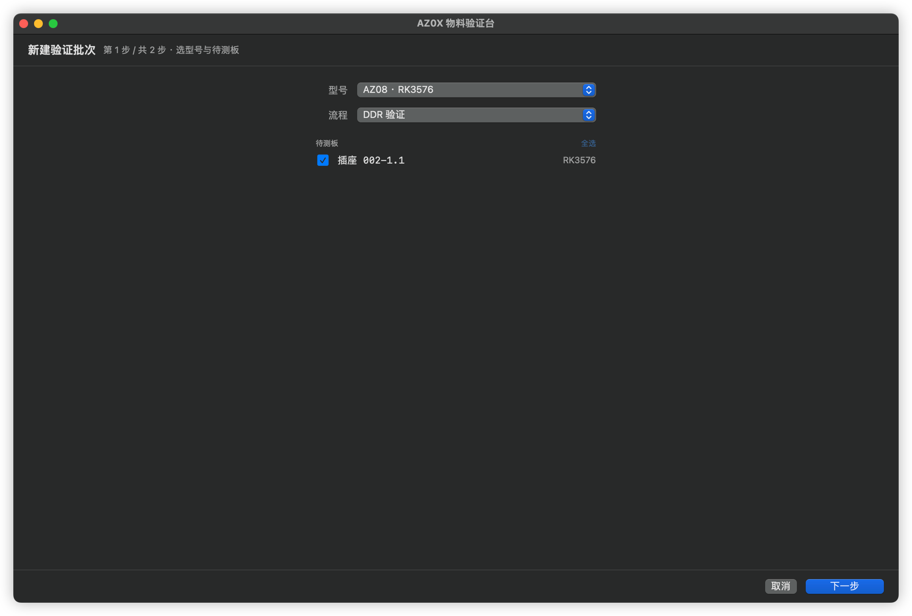
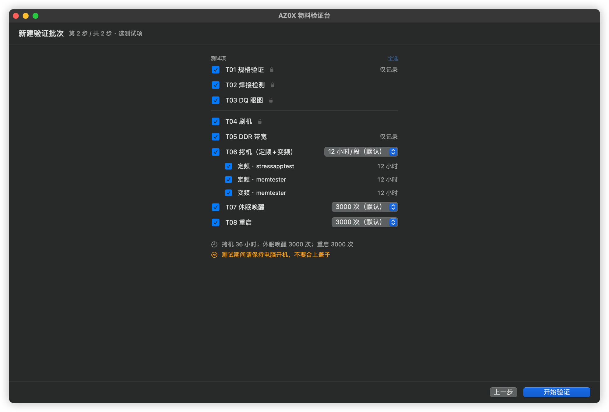
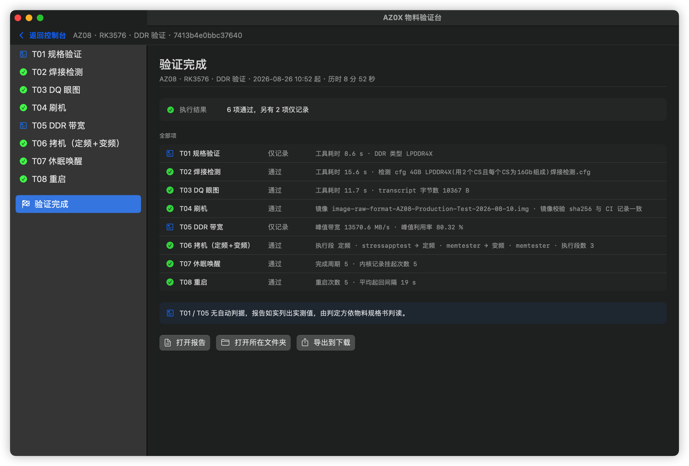
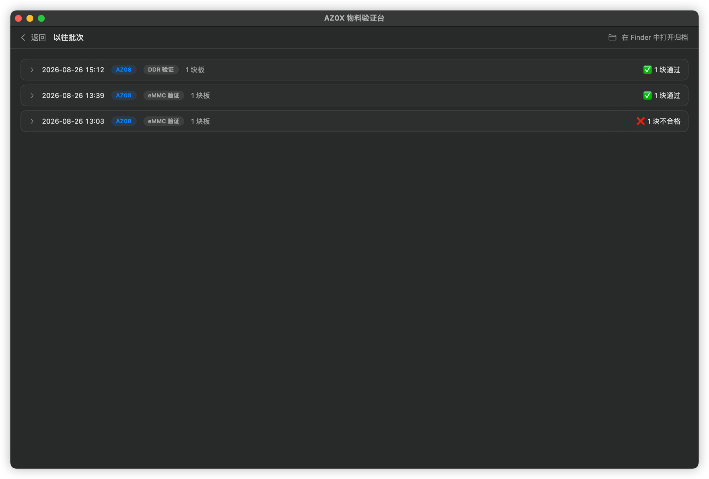

# Rockchip 物料验证台

macOS 上的 Rockchip 平台来料验证工具。将待测板置于 MASKROM 模式，选定验证流程，执行完成后生成验证报告。

**DDR** 八项 · **eMMC** 六项 · 支持多板并行验证。
适用型号 AZ04A · AZ04B · AZ05 · AZ07 · AZ08 · Mixtile Core3588E

---

## 安装

于 [Releases](../../releases) 下载最新 DMG，拖入「应用程序」。

**首次打开时系统会阻止运行**：右键点击应用图标，选择「打开」。此后可正常双击启动。

要求 macOS 13 或更高版本。

---

## 操作步骤

### 一、启动



### 二、将待测板置于 MASKROM 模式，点击「开始验证」



选定型号与验证流程，勾选待测板。



勾选测试项。带锁标记的测试项不可取消。右侧可设定各长测项的执行量：

| 测试项 | 默认量 | 最小量 |
|---|---|---|
| 拷机（定频+变频） | 12 小时/段 × 3 段 | 1 分钟/段 |
| 休眠唤醒 | 3000 次 | 5 次 |
| 重启 | 3000 次 | 5 次 |
| eMMC 拷机 | 20 次全盘写 | 1 次 |

### 三、执行

各工位独立执行，互不影响。点击任一待测板可查看该板每一测试项的实测值、判据结论与板端日志。

**验证一经开始不可中断。** 拷机中断后无法续跑，只能整板重新验证。



### 四、查看报告

报告与原始记录按板存放于：

```
~/Documents/Rockchip 物料验证/AZ08-DDR-20260826-105228/002-1.4-2207-350E-NA/
    …-报告.md      验证报告
    run.json       完整记录
    logs/          板端原始日志
```

亦可在软件内点击「打开报告」直接打开。

### 五、查阅以往批次



记录保存在本地，退出软件不会丢失。可查看各板结论，或直接打开当时的报告。

---

## 报告中的四种结论

| 结论 | 含义 | 处理方式 |
|---|---|---|
| ✅ **通过** | 该项判据全部通过 | — |
| ❌ **不合格** | 判据未通过，属物料问题。**后续测试项不再执行** | 该板从来料中剔除 |
| ⚠️ **未得结果** | **不属物料问题**：工具无输出、设备未枚举、日志不可读等 | 依报告所述原因排除后重新验证 |
| 📊 **仅记录** | 该项无自动判据 | 报告列出实测值，由判定方依物料规格书判读 |

**「未得结果」与「不合格」是两种不同的结论**：前者表示本轮未能得出结论，后者表示已测出物料问题。

仅记录项：DDR 的 T01 规格验证、T05 带宽；eMMC 的 E03、E06 读写性能。

---

## 验证流程

### DDR

| 编号 | 测试项 | 检测内容 |
|---|---|---|
| T01 | 规格验证 | 探测 DDR 实际规格并匹配配置，供人工与物料核对 |
| T02 | 焊接检测 | DQS / DQ / DM / CA / CS / ZQ 各信号焊接质量 |
| T03 | DQ 眼图 | 扫描各 DQ 眼图，评估信号裕量 |
| T04 | 刷机 | 取最新生产镜像刷入，验证烧录通路 |
| T05 | DDR 带宽 | 锁定最高频率满载加压，采样实测带宽峰值 |
| T06 | 拷机 | 定频与变频段长时间压力测试，检测位错与切频稳定性 |
| T07 | 休眠唤醒 | 反复挂起与唤醒，检验低功耗进出稳定性 |
| T08 | 重启 | 反复重启，检验每次 DDR 初始化稳定性 |

### eMMC

| 编号 | 测试项 | 检测内容 |
|---|---|---|
| E01 | 刷机 | 取最新生产镜像刷入 eMMC，验证写入通路 |
| E02 | 规格识别 + 健康状态 | 器件身份、寿命消耗、总线协商结果 |
| E03 | 读写性能 | 顺序与随机读写 |
| E04 | 数据完整性 | 写入后回读校验 |
| E05 | 拷机 | 按目标写入量反复读写并回读校验 |
| E06 | 拷机后读写性能 | 与 E03 同参数复测，前后对比 |

---

## 常见问题

**待测板未出现在列表中**
型号选择有误（列表仅显示型号匹配的板卡）；板卡未进入 MASKROM 模式；或该板已被其他工位占用。

**首次打开提示「无法打开」**
右键点击应用图标选择「打开」，或于「系统设置 → 隐私与安全性」中允许运行。

**报告显示「未得结果」**
报告中会写明具体测试项与原因。**此结论不构成物料判定**，排除原因后重新验证即可。

**某型号缺少若干测试项**
该型号不具备相应功能（如不支持眼图扫描），验证序列本身不含该项，报告中会写明原因。
